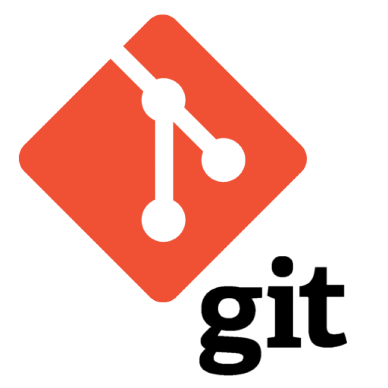
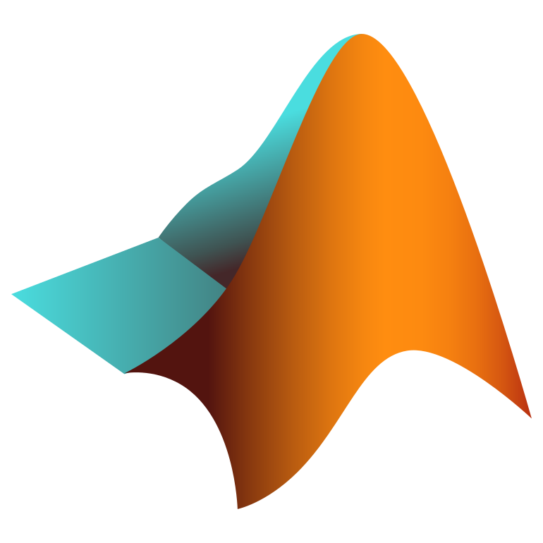

  
  

    
  ### Hello World! :computer:

[+] Connecting to K-O-V-I-D.git  
[+] Waiting for Connection.....  
[+] Connected to K-O-V-I-D.git as KOVID  

"In the realm of full stack mastery, I wear the hats of both creator and guardian. I choreograph elegance and safeguard systems with a cyber sentinel's watchful eye. My code is not just a language; it's a shield, protecting the digital frontier. Step into a world where every function is a shield, and every design choice is a step towards a secure tomorrow."

## Portfolio

[Portfolio]([https://k-o-v-i-d.github.io/Kovid-Tiwari.github.io/])

## Rapidfire  

- 🎓 Currently Pursuing Int.M.tech CSE - Cyber Security at Vellore Institute Of Technology, Bhopal. 

- 👀  Aspiring Software Developer | Cyber Security Enthusiast.
   
- 🌱  Currently learning: Expanding proficiencies in Frontend-Backend, Cyber Security & staying updated with the latest in Cloud Computing.

- 🤝  Always ready to collaborate on Open-source & Start-up projects.

-  👾 Fun fact Everything that has been or could be written/said already exists in the Library of God.

## GitHub Stats📊  

  

  

## 🛠  Tech Stack

  <!-- First row of images -->
  <code></code>
  <code></code>
  <code></code>
  <code></code>
  <code></code>
  <code></code>
  <code></code>
  <code></code>
  <code></code>
  <code></code>
  <code></code>
  <code></code>
  <code></code>
  <code></code>

 

  <!-- Second row of images -->
  <code></code>
  <code></code>
  <code></code>
  
  <code></code>
  <code></code>
  <code></code>
  <code></code>

 

## Projects 🌐

#### 🧠 Analytical Portal for Police Department

[Analytical-Portal-for-Police-Department.github.io](https://k-o-v-i-d.github.io/Analytical-Portal-for-Police-Department.github.io/) Citizens can easily give feedback. Mobile web browser-based interface. Officers can get details of quality of service of any police station by analysis of related data. 
GitHub [Repo](https://github.com/K-O-V-I-D/Analytical-Portal-for-Police-Department.github.io)
##### Tech Stack

  
  
  

  
  

#### 💬 No Proxy Attendance

[No-Proxy-Attendance.github.io](https://github.com/K-O-V-I-D/No-Proxy-Attendance.github.io) 
A hassle-free solution for marking attendance within college network. 
GitHub [Repo](https://github.com/K-O-V-I-D/No-Proxy-Attendance.github.io)
##### Tech Stack

  
  
  
  
  

#### 💪 CIAM

[CIAM](https://github.com/K-O-V-I-D/CIAM) Container Identity Access Management Protocol 
GitHub [Repo](https://github.com/K-O-V-I-D/CIAM)
##### Tech Stack

  
  
  
  
  

<h3 align="left">Reach out to me</h3>

